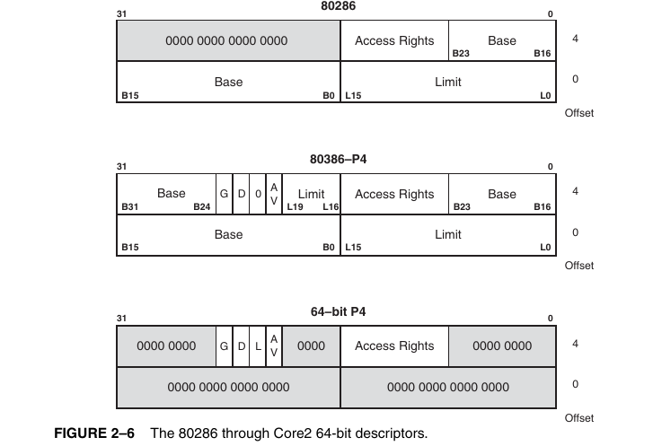
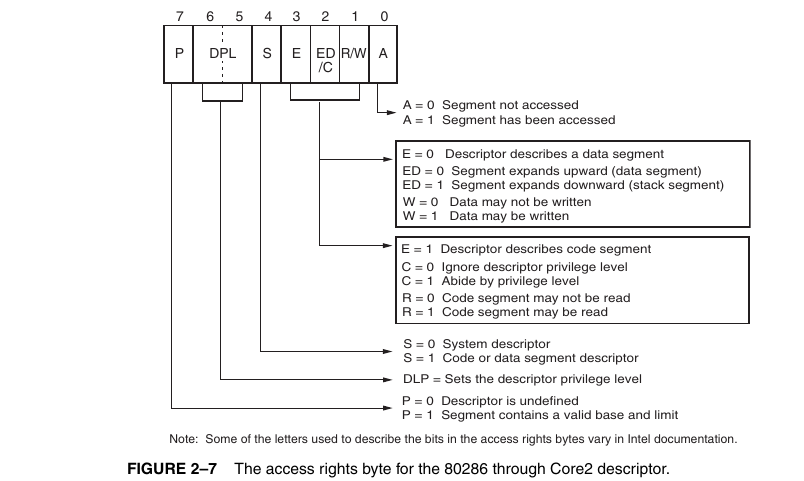
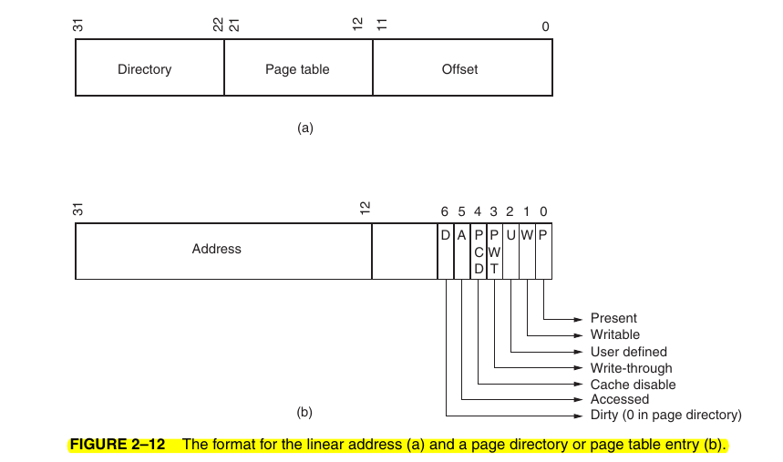
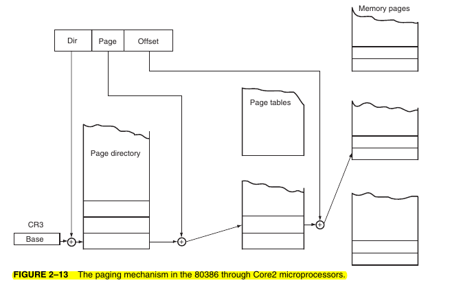
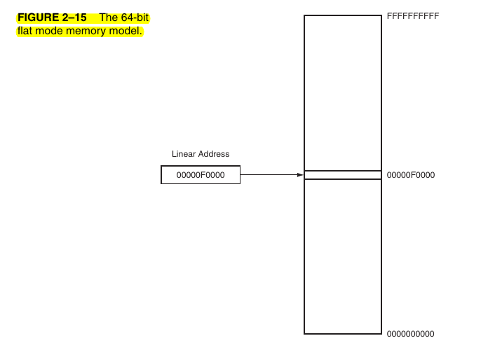

# 🖥 Chapter 2 – The Microprocessor and Its Architecture

---

## 🔹 Introduction

* Microprocessor হলো একটি **programmable device**।
* প্রথমে এর **internal programming model** দেখা হয়, তারপর দেখা হয় কিভাবে **memory space address করা হয়**।
* Intel family processors এ পাওয়া যায়:

  * **Real Mode Memory (DOS memory):** 1MB
  * **Protected Mode Memory (Windows memory):** 16MB–64TB
  * **Flat Mode Memory (64-bit extensions):** 1TB+
* Windows 64-bit ব্যবহার করতে হলে **Flat Mode** দরকার।

---

## 🔹 Objectives

এই অধ্যায় শেষে শিখবে:

1. 8086–Core2 পর্যন্ত **program-visible registers**
2. **Flag Register** এবং প্রতিটি flag এর কাজ
3. **Real Mode Memory Addressing**
4. **Protected Mode Memory Addressing**
5. **64-bit Flat Memory Model**
6. **Program-invisible registers** (80286+)
7. **Paging mechanism**

---

## 🔹 Programming Model (Registers)

### 8-bit Registers

`AH, AL, BH, BL, CH, CL, DH, DL`

👉 Example: `ADD AL, AH`

### 16-bit Registers

`AX, BX, CX, DX, SP, BP, SI, DI, IP, FLAGS, CS, DS, ES, SS, FS, GS`

👉 AX = AH + AL

### 32-bit Registers (80386+)

`EAX, EBX, ECX, EDX, ESI, EDI, ESP, EBP, EIP, EFLAGS, FS, GS`

👉 Example: `ADD ECX, EBX`

### 64-bit Registers (Pentium 4/Core2+)

`RAX, RBX, RCX, RDX, RSP, RBP, RSI, RDI, R8–R15`

👉 Example: `ADD RCX, RBX`

📌 Rule:

* R8–R15 → Byte, Word, Dword, Qword হিসেবে ব্যবহারযোগ্য
* High-byte registers (AH, BH…) R8–R15 এর সাথে একসাথে ব্যবহার হয় না

---

### Multipurpose Registers

* **RAX** → Accumulator (arithmetic, multiply/divide)
* **RBX** → Base/index
* **RCX** → Counter (loop, shift, REP)
* **RDX** → Mul/div operations
* **RBP** → Base pointer (stack)
* **RSI, RDI** → String operations
* **R8–R15** → Extra general-purpose (64-bit mode)

### Special-Purpose Registers

1. **RIP (Instruction Pointer)**

   * Real Mode → IP (16-bit)
   * Protected → EIP (32-bit)
   * 64-bit → RIP (40-bit)

2. **RSP (Stack Pointer)**

   * SP (16-bit), ESP (32-bit), RSP (64-bit)

3. **RFLAGS**

   * 16-bit FLAGS → 32-bit EFLAGS → 64-bit RFLAGS

---

### Flag Register (Important Bits)

* C → Carry
* P → Parity
* A → Auxiliary carry
* Z → Zero
* S → Sign
* T → Trap (debug)
* I → Interrupt enable
* D → Direction (string ops)
* O → Overflow
* IOPL → I/O privilege
* NT, RF, VM, AC, VIF, VIP, ID → Special control/debug flags

---

### Segment Registers

* **CS** → Code
* **DS** → Data
* **ES** → Extra
* **SS** → Stack
* **FS, GS** → Extra (Windows internal)

📌 Mode differences:

* Real Mode → 64KB segment
* Protected Mode → Up to 4GB
* 64-bit Flat → Segmentation প্রায় ব্যবহার হয় না (শুধু CS)

---

## 🔹 Real Mode Memory Addressing

* **Available in 8086, 8088, and all CPUs at reset**
* Max memory = **1MB (00000H–FFFFFH)**
* Used in **DOS**, not in Windows
* Address = **Segment × 10H + Offset**

📌 Example:

* CS = `1000H`, IP = `2000H`
* Address = `10000H + 2000H = 12000H`

### Key Points

* Segment = 64KB long
* Always starts at **16-byte boundary**
* High memory (A20 line) → 1MB এর পর সামান্য extension
* Default segment usage:

  * CS:IP → Code
  * SS:SP → Stack
  * DS:BX/SI/DI → Data
  * ES:DI → String destination

👉 Advantage → **Relocatable programs** (only change segment base)

---

## 🔹 Protected Mode Memory Addressing

* Introduced with **80286**
* Access extended memory > 1MB
* Address = **Selector (segment register) + Offset**
* Selector → Descriptor → {Base, Limit, Access Rights}

### Descriptor Tables

* **GDT** (Global) → system segments
* **LDT** (Local) → application segments
* Max = 8192 + 8192 = 16,384 descriptors
* Each descriptor = 8 bytes → up to **64TB memory**

### Offset

* 16-bit (80286) → 64KB
* 32-bit (80386+) → 4GB

### Access Rights

* Data/code type
* Growth direction
* Write/read protection
* Privilege level (Ring 0–3)

### Privilege Levels (Rings)

* 0 → Kernel
* 3 → Applications  
  👉 Windows uses ring 0 + ring 3

### Program-Invisible Registers

* **GDTR** → Global Descriptor Table Register
* **IDTR** → Interrupt Descriptor Table Register
* **LDTR** → Local Descriptor Table Register
* **TR** → Task Register

---

## 🔹 Paging

* **80386+ feature**
* Maps **Linear Address → Physical Address**
* Controlled by **CR0–CR4**

### Registers

* **CR0.PG** → Enable/disable paging
* **CR3** → Page Directory Base Address
* **CR4** → Large page size (2MB/4MB)

### Linear Address Breakdown (32-bit)

* Directory (10 bits) → Page Directory Entry
* Table (10 bits) → Page Table Entry
* Offset (12 bits) → Inside page

### Page Structures

* Page Directory = 1024 entries (4KB)
* Page Table = 1024 entries (4KB)
* Each entry → 4KB page

👉 Covers 4GB total

### TLB (Translation Look-aside Buffer)

* Caches page translations
* Faster access, avoids repeated table lookups

### OS Usage

* DOS (EMM386.EXE) → Upper Memory Blocks
* Windows → 2GB linear space per app
* Pentium+ → Page sizes = 4KB, 2MB, 4MB

---

## 🔹 Flat Mode Memory (64-bit)

* Found in Pentium 4, Core2 (64-bit extensions)
* **Segmentation disabled**
* Memory range: `0000 0000 0000H` – `FFFF FFFF FFFFH` (40-bit → 1TB)
* **CS register** → Only access rights + privilege
* **Offset = Physical Address**

### Modes

* **IA-32 Compatibility Mode (L=0)**

  * Address = 64-bit, but only 40-bit valid
  * RIP-relative addressing (±2GB displacement)
  * Some instructions use full 64-bit immediate address

* **Full 64-bit Mode (L=1)**

  * Address size = 32-bit or 64-bit (instruction dependent)

### Protection

* No segmentation protection
* But **Protection + Paging** still active

### Software Situation

* Most programs still run in **IA-32 compatibility**
* Future → shift to **full 64-bit**

---

## ✅ Summary Table

| Mode           | Max Address Space         | Addressing        | Segment Size | Special Features                    |
| -------------- | ------------------------- | ----------------- | ------------ | ----------------------------------- |
| Real Mode      | 1MB (20-bit)              | Segment + Offset  | 64KB         | Backward compatibility, relocatable |
| Protected Mode | 64TB (32-bit+Descriptors) | Selector + Offset | 4GB          | GDT, LDT, Rings, Privilege          |
| Paging         | 4GB (32-bit)              | Linear → Physical | 4KB–4MB      | Virtual memory, TLB                 |
| Flat Mode      | 1TB+ (40-bit pins)        | Offset = Physical | N/A          | 64-bit extensions, RIP-relative     |

---

👉 এই নোটস পুরো Chapter 2 কভার করে: **Registers, Real Mode, Protected Mode, Paging, Flat Mode**।
